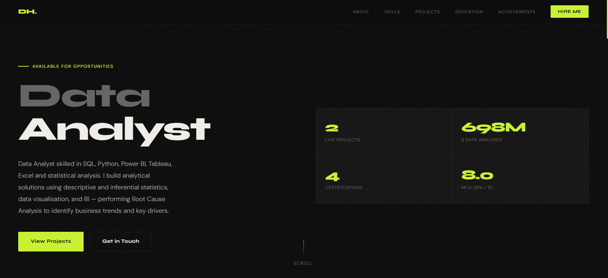
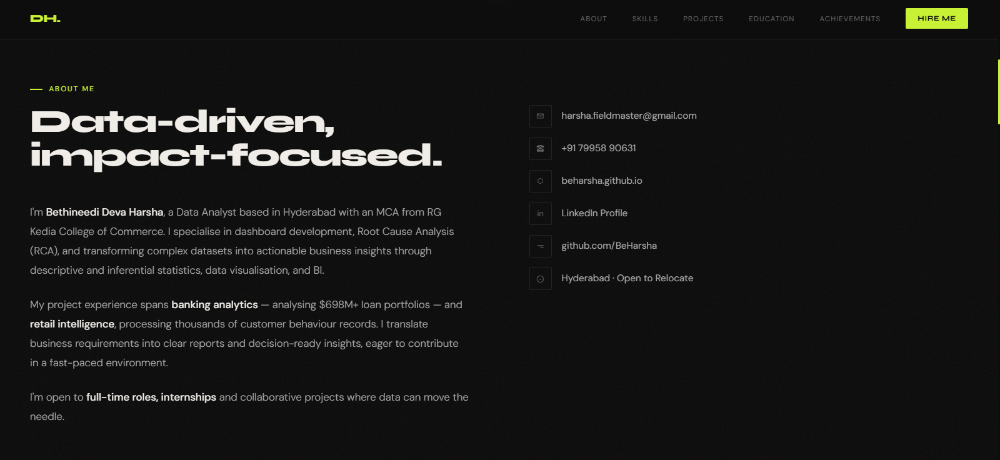
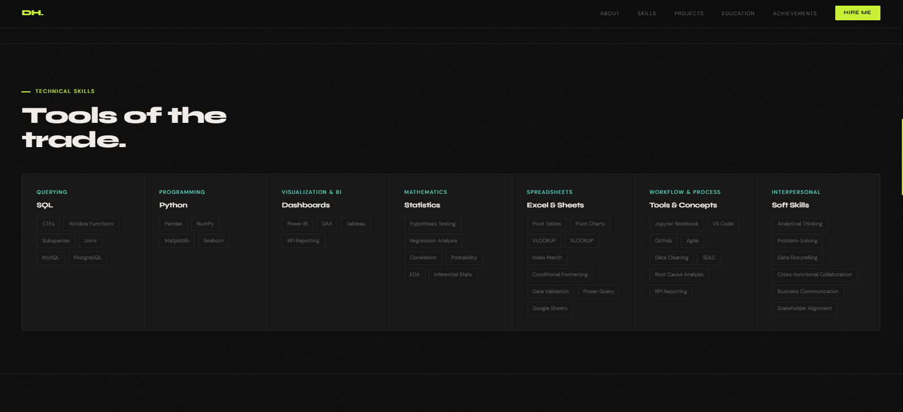
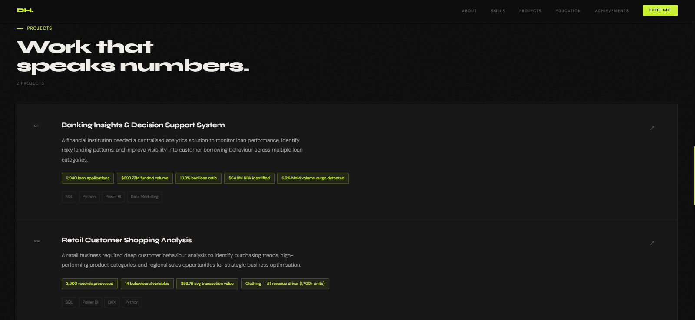
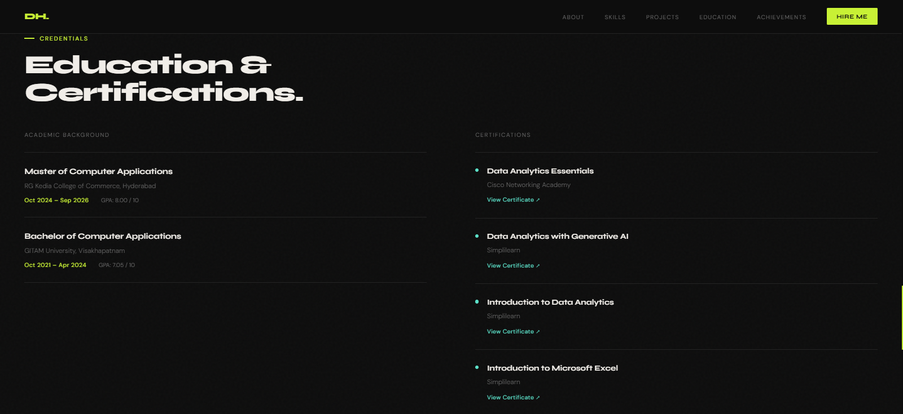

# Bethineedi Deva Harsha — Portfolio Website

<p align="center">
  
  
</p>


## Live Portfolio Website

 **Visit Here:**  
 https://beharsha.github.io


## About Me

Hi, I'm **Bethineedi Deva Harsha**, a passionate **Data Analyst** skilled in transforming raw data into actionable business insights using:

- SQL
- Python
- Power BI
- Tableau
- Excel
- Statistics


I specialize in:
- Exploratory Data Analysis (EDA)
- Dashboard Development
- KPI Reporting
- Business Intelligence
- Data Cleaning & Transformation
- Analytical Problem Solving


This repository hosts my personal portfolio website showcasing:
- Projects
- Technical Skills
- Education & Certifications
- Contact Information


# Featured Projects

## Banking Insights and Decision Support System

🔗 GitHub Repository:  
https://github.com/BeHarsha/Banking_Insights_and_Decision_Support_System

### Overview
A comprehensive banking analytics solution designed to:
- Monitor loan performance
- Detect risky lending patterns
- Analyze customer borrowing behavior
- Improve operational decision-making

### Key Highlights
- Analysed **2,940 loan applications**
- Evaluated **$698.73M** in received payments
- Identified **13.8% bad loan ratio**
- Detected **$64.9M non-performing assets**
- Developed interactive **Power BI dashboards**
- Automated Month-over-Month KPI tracking

### Technologies Used
- SQL
- Power BI
- Python
- Data Modelling


## Retail Customer Shopping Analysis

🔗 GitHub Repository:  
https://github.com/BeHarsha/Retail_Customer_Shopping_Analysis

### Overview
A retail analytics project focused on:
- Customer behavior analysis
- Regional sales trends
- Product performance optimization
- Business intelligence reporting

### Key Highlights
- Processed **3,900 retail records**
- Analysed **14 customer behavior variables**
- Identified top-performing product categories
- Generated regional sales insights
- Built business dashboards for decision-making

### Technologies Used
- Power BI
- Python
- DAX
- Data Visualization


# Technical Skills

## Programming & Query Languages
- SQL
- Python

## Data Analytics & BI
- Power BI
- Tableau
- Excel
- KPI Reporting
- Dashboard Development

## Databases
- MySQL
- PostgreSQL

## Statistics & Analytics
- Hypothesis Testing
- Regression Analysis
- Correlation Analysis
- Probability
- Descriptive Statistics
- Inferential Statistics

## Tools & Platforms
- GitHub
- Jupyter Notebook
- Visual Studio Code


# Certifications

- Data Analytics Essentials — Cisco Networking Academy
- Data Analytics with Generative AI — Simplilearn
- Introduction to Data Analytics — Simplilearn
- Introduction to Microsoft Excel — Simplilearn


# Achievements

- Data Analytics Essentials Badge — Cisco Networking Academy


# Education

## Master of Computer Applications (MCA)
RG Kedia College of Commerce, Hyderabad  
Oct 2024 – June 2026  
GPA: 8.0/10

## Bachelor of Computer Applications (BCA)
GITAM University, Visakhapatnam  
Oct 2021 – Apr 2024  
GPA: 7.05/10


# Portfolio Preview

## Home


## About


## Skills


## Projects


## Credentials



# Run Locally

Clone the repository:

```bash
git clone https://github.com/BeHarsha/beharsha.github.io.git
```


# Portfolio Features

✅ Responsive Design  
✅ Interactive UI  
✅ Smooth Navigation  
✅ Project Showcase  
✅ Skills Section  
✅ Contact Section  
✅ Recruiter Friendly Layout  


# Connect With Me

## Portfolio
https://beharsha.github.io

## LinkedIn
(https://www.linkedin.com/in/bethineedi-deva-harsha-3933aa2a9)

## GitHub
https://github.com/BeHarsha

## Email
harsha.fieldmaster@gmail.com


# ⭐ Support

If you like this portfolio repository, consider giving it a ⭐ on GitHub


# License

This project is licensed under the MIT License.


<p align="center">
  Built with ❤️ by Bethineedi Deva Harsha
</p>
